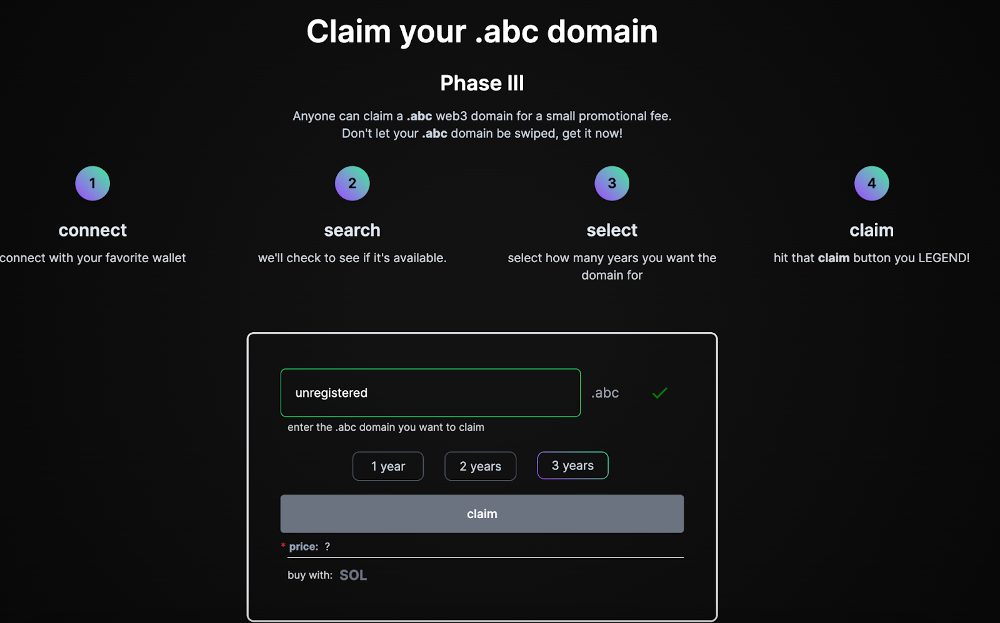
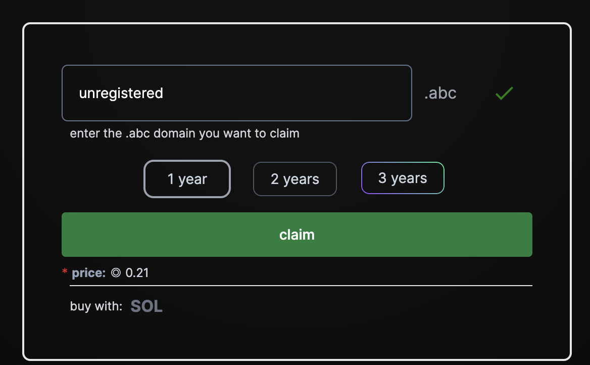

# Purchasing a domain

### Register a new domain:

1. Go to to [**abc.onsol.io**](https://abc.onsol.io) or [**thepoor.club**](https://thepoor.club) or [**bonk.onsol.io**](https://bonk.onsol.io)
2. Search for the domain name you want. In this example I have used "_unregistered_” and this domain appears to be unregistered\

<figure><figcaption>
Search for Domain
</figcaption></figure>

3. Select the number of **years** for which you want to own the domain

<figure><figcaption>
Select duration
</figcaption></figure>

4. Click **claim** and approve wallet transaction to buy the domain.

### Buy a domain from a Marketplace:

You can also purchase a domain on most of the popular **NFT Marketplaces** on Solana.&#x20;

Simply search "**ABC Domain Collection**" or "**Bonk Domain Collection**" or "**Poor Domain Collection**" on any of these marketplaces to start browsing NFT domains

e.g.

* [https://magiceden.io/marketplace/abc\_domains](https://magiceden.io/marketplace/abc\_domains)
* [https://www.tensor.trade/trade/abc\_domains](https://www.tensor.trade/trade/abc\_domains)
* [https://hyperspace.xyz/collection/abcdomains](https://hyperspace.xyz/collection/abcdomains)

