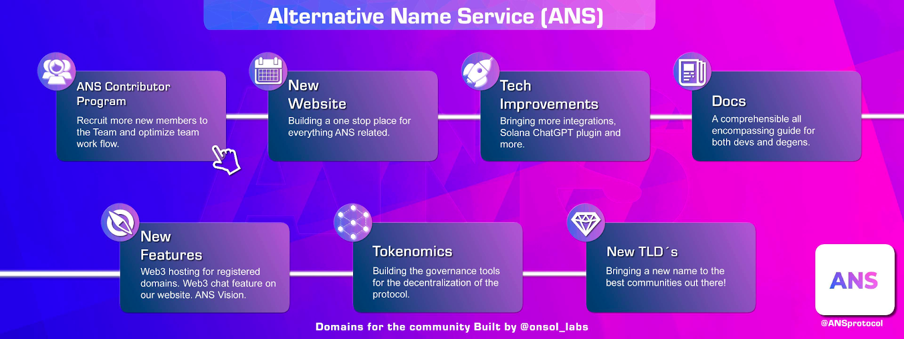

# Roadmap

### A new website

ANS Protocol will have a new website that will include all the products releases, with a new design and to become the one stop place for everything you need to know about us

### Tokenomics

As the mission is to become a decentralized protocol that will be owned by the community, we are working on our future tokenomics that will govern and sustain the protocol and the community. Expect this to be announced step by step and a whitepaper will explain what we intend to do in our future.

### New TLDs

We started discussing with some interesting projects that want to have their own TLD’s. Once the new website is done, we will slowly decentralize the access with the aim of using our token in the process. More details will be revealed as we move along the road.

### New Features

Yes, we are working on new features that will be built with selected partners.&#x20;

\
Follow us on Twitter [https://twitter.com/ANSprotocol](https://twitter.com/ANSprotocol) for weekly updates

<figure><figcaption></figcaption></figure>
