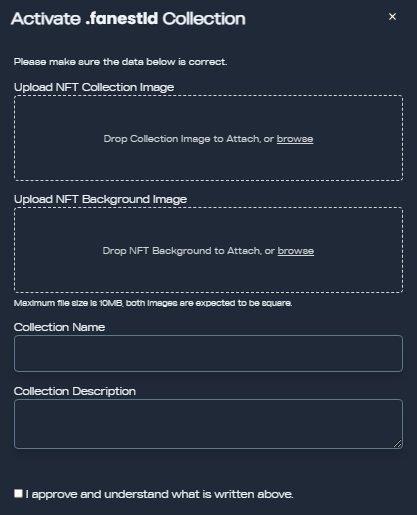
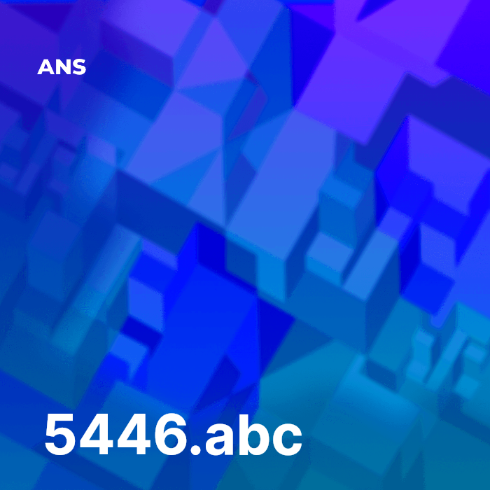

# Enable secondary market trading

To allow your users to start trading you will have to set up your NFT collection. After activating your TLD go to Dashboard, hit the TLDs tab, and click Activate NFTs.

**Pay attention while completing the following prompt as these uploads are hard to edit afterward they require Metaplex updates!**\
\

<figure><figcaption>
Activate NFT Collection
</figcaption></figure>

1. Upload NFT Collection Image: This will set your collection image for marketplaces to display on the first page or in the search bar - the image has to be 700x700 maximum 1mb
2. Upload NFT Background Image: This will be the template for all your domain names NFT that will be generated by wrapping domain names. **While choosing a background image be mindful that the domain name text will be generated on the NFT in a lower left position in white font!** - the image has to be 700x700 maximum 1mb

e.g. this is the background we used for .abc domain names

<figure><figcaption>
.abc NFT example
</figcaption></figure>

3. Pick a Collection Name: This will be the name by which your collection will apper in marketplaces and how your users will be able to search for you!

e.g. .bonk Domain Names

4. Collection Description: This provides a short description for marketplaces to add to your collection

When selecting visual backgrounds for your NFTs, we kindly request that you adhere to the existing marketplace listing rules. Explicit content, including but not limited to images of violence and links to pornography, must not be published. We aim to maintain a family-friendly and safe environment for all NFT enthusiasts.

AllDomains offers the functionality to wrap domains as NFTs using our Activate NFT feature. However, please be advised that we do not automatically list these NFTs on external marketplaces. The responsibility for creating a verified collection lies solely with the TLD buyer.
