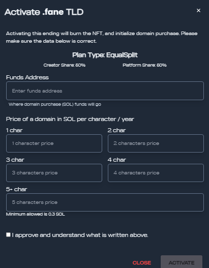
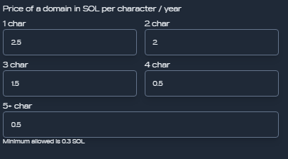

# Set up your own payment scheme

If you have your TLD NFT and want to allow users to start domain name registrations you’ll first need to ACTIVATE your TLD.

Head over to our [**Dashboard**](https://alldomains.id/dashboard) and click the TLDs tab. Choose the TLD you want to enable and click “ACTIVATE”

Now it’s time to set up your domain registration prices. Fill in the inputs:

<figure><figcaption>
Activating a TLD
</figcaption></figure>

The funds' address is where you will fill in the wallet that will receive your share of the revenue from user domain name registrations and royalties for secondary market sales!

The registration prices can be set up with different values for different-length domain names. As shorter domain names are rarer and thus more valuable, you can choose higher registration fees for those. E.G.:

<figure><figcaption>
Price per domain length
</figcaption></figure>

After setting them up, prices can be edited unlimited times. This will allow you to increase/decrease prices at will, start flash-sales campaigns, etc.

After all is set click activate! This will BURN your TLD NFT and will allow users to start registering domain names with your associated TLD!
