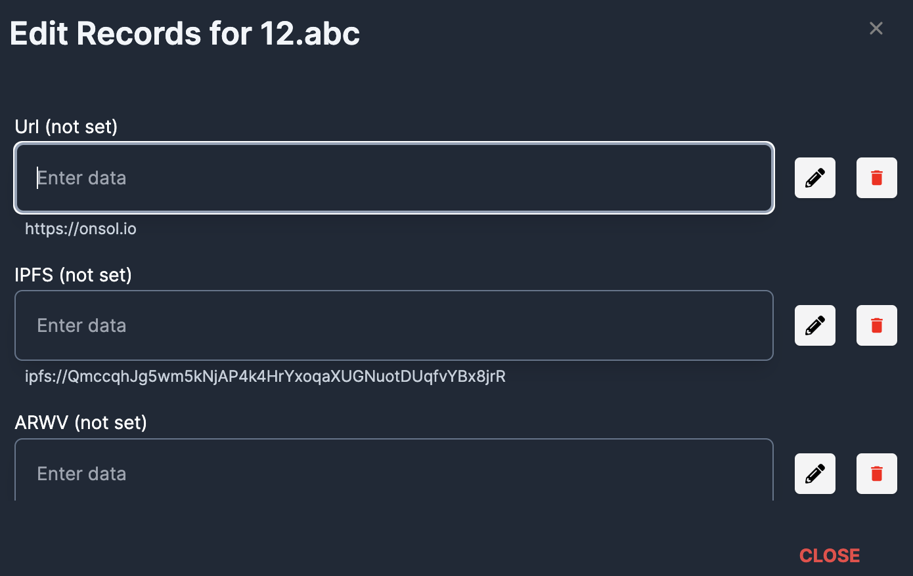
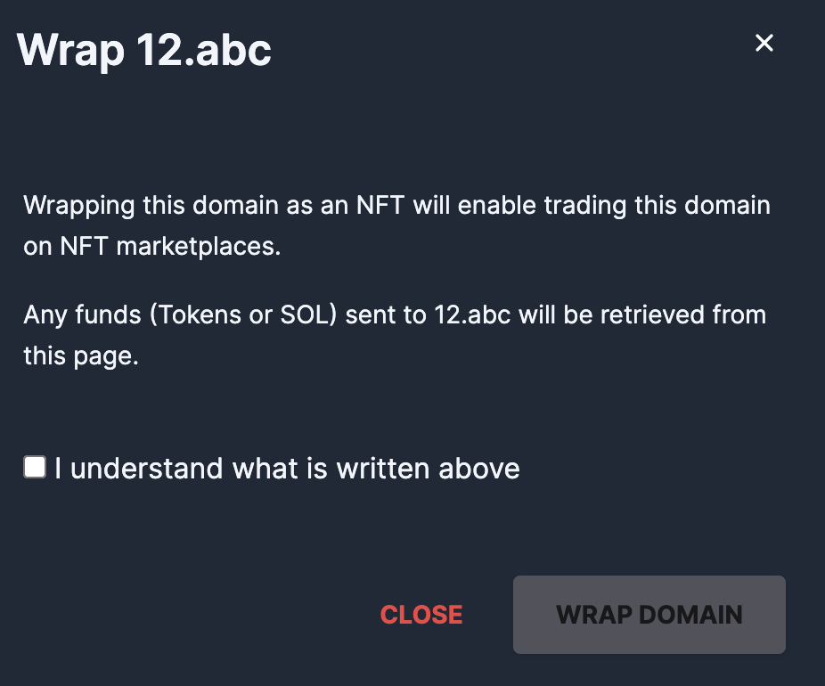
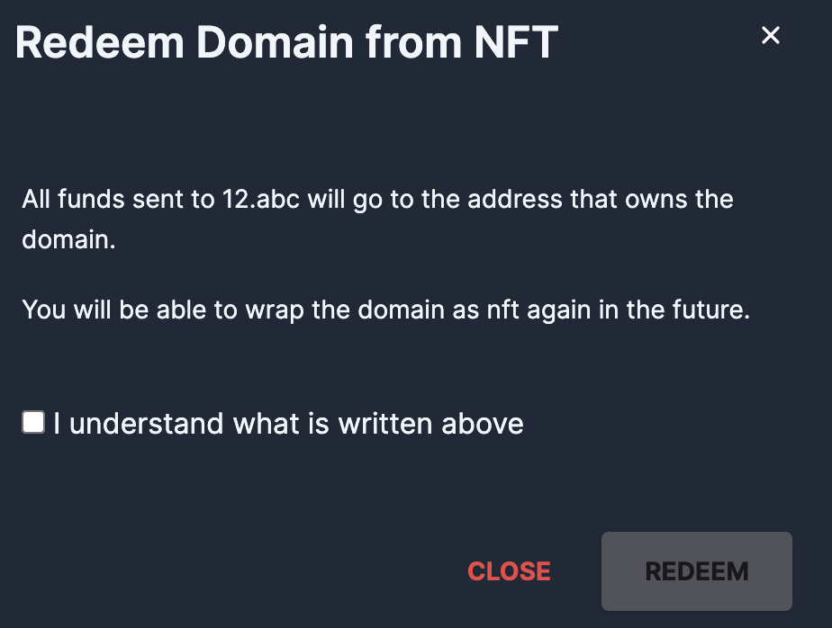

# Manage your domains

To manage your domains, go to[alldomains.id](https://alldomains.id/), connect your wallet and click on **Dashboard**.

<figure><figcaption></figcaption></figure>

### **Set your Main Domain**

You can set your main domain by clicking the "☆" icon next to one of your domains.

<figure><figcaption></figcaption></figure>

### Extend/Renew domain

You can renew in advance and extend your domains

<figure><figcaption>
Extend domain
</figcaption></figure>

**Domain Records**

You can edit the records of your domain by clicking the **Records** button under the domain name.

<figure><figcaption>
Edit Recor
</figcaption></figure>

### Transfer a domain

Easily transfer your domain to another Solana address

1. Click on the Send button next to the domain you want to transfer

<figure><figcaption></figcaption></figure>

2. In the Modal window that appears enter the Solana address you want to send the domain to and click Transfer

<figure><figcaption>
Transfer Domain
</figcaption></figure>

**Wrap /Unwrap a domain name to/from an NFT**

Depending on the state of a domain a there is either a "**Wrap**" or "**Unwrap**" button next to it.

If you click on any of the Wrap or Unwrap buttons a modal to change the state from and to an NFT appears depending on the domain's current state.

<figure><figcaption>
Wrap Domain
</figcaption></figure>

<figure><figcaption>
Unwrap Domain
</figcaption></figure>

While your domain is wrapped as an NFT you can withdraw all tokens available in that address:

<figure><figcaption>
Withdraw
</figcaption></figure>

Wrapped domain names can be transferred as regular NFTs directly from your Solana Wallet.
