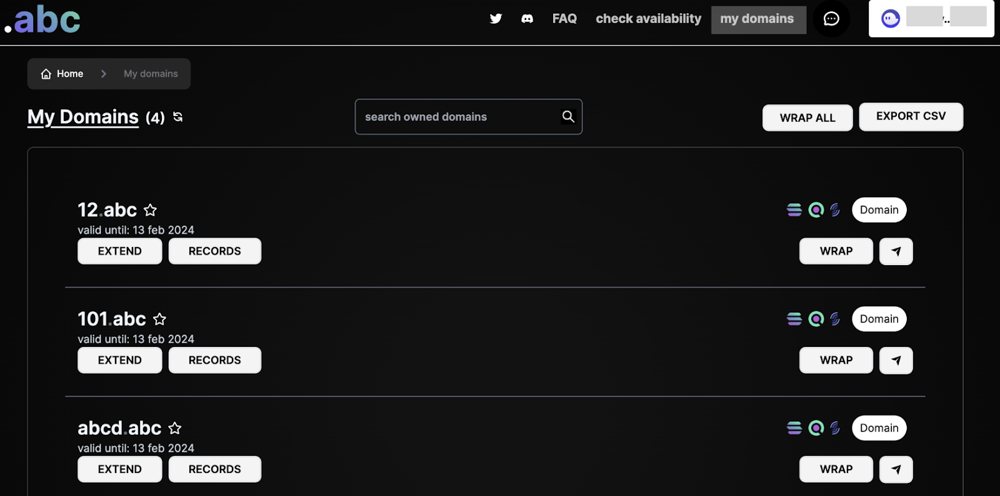
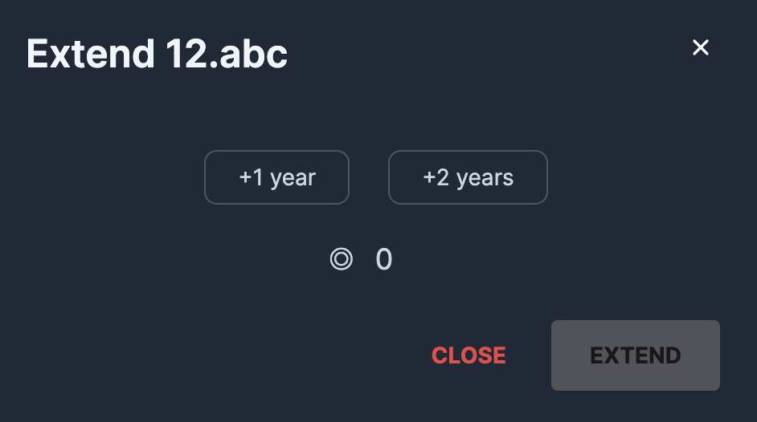
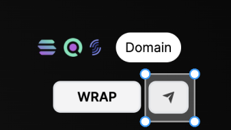

# Manage your domains

To manage your domains, go to [**abc.onsol.io**](https://abc.onsol.io)**,** connect your wallet and click on **my domains.**

<figure><figcaption>
My Domains
</figcaption></figure>

### **Set your Main Domain**

You can set your main domain by clicking the "☆" icon next to one of your domains.

### Extend/Renew domain

You can renew in advance and extend your domains for up to 2 more years.

<figure><figcaption>
Extend domain
</figcaption></figure>

### **Domain Records**

You can edit the records of your domain by clicking the Records button under the domain name.

<figure><figcaption>
Edit Records
</figcaption></figure>

### Transfer a domain

Easily transfer your domain to another Solana address

1. Click on the Send button next to the domain you want to transfer

2. In the Modal window that appears enter the Solana address you want to send the domain to and click Transfer

<figure><figcaption>
Transfer Domain
</figcaption></figure>

### Wrap /Unwrap a domain name to/from an NFT

Depending on the state of a domain a there is either a "**Wrap**" or "**Unwrap**" button next to it.

If you click on any of the Wrap or Unwrap buttons a modal to change the state from and to an NFT appears depending on the domain's current state.

<figure><figcaption>
Wrap Domain
</figcaption></figure>

<figure><figcaption>
Unwrap Domain
</figcaption></figure>

While your domain is wrapped as an NFT you can withdraw all tokens available in that address:

Wrapped domain names can be transferred as regular NFTs!
