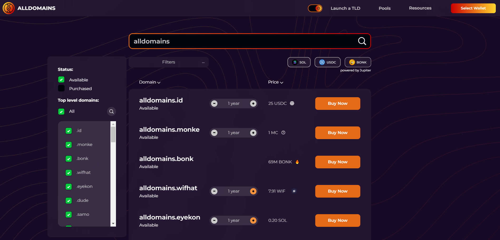

# Register a domain name

#### To r**egister a new domain:**

1. Go to[ alldomains.id](https://alldomains.id/)​
2. Search for the domain name you want:

<figure><figcaption>
Search for a Domain Name 
</figcaption></figure>

3. If you don't know exactly what you're looking for, scroll up and down the TLD list and find your favorite one! \
   Alternatively, if you know exactly what domain name you want, just type in the complete domain in the search bar (e.g. alldomains.maxi) to get that specific result


You can use filters to select certain TLDs to compare prices or check the expiration dates for previously purchased domain names.\
\
Feel free to play around and discover your best choice!


4. Once you have decided on the domain name you want to purchase, select the SPL you want to use for your purchase and the renewal period, and click Buy Now.&#x20;


Some domain names are only available through community-specific tokens (e.g. .superteam domains require a specific token you can only acquire from Superteam)

